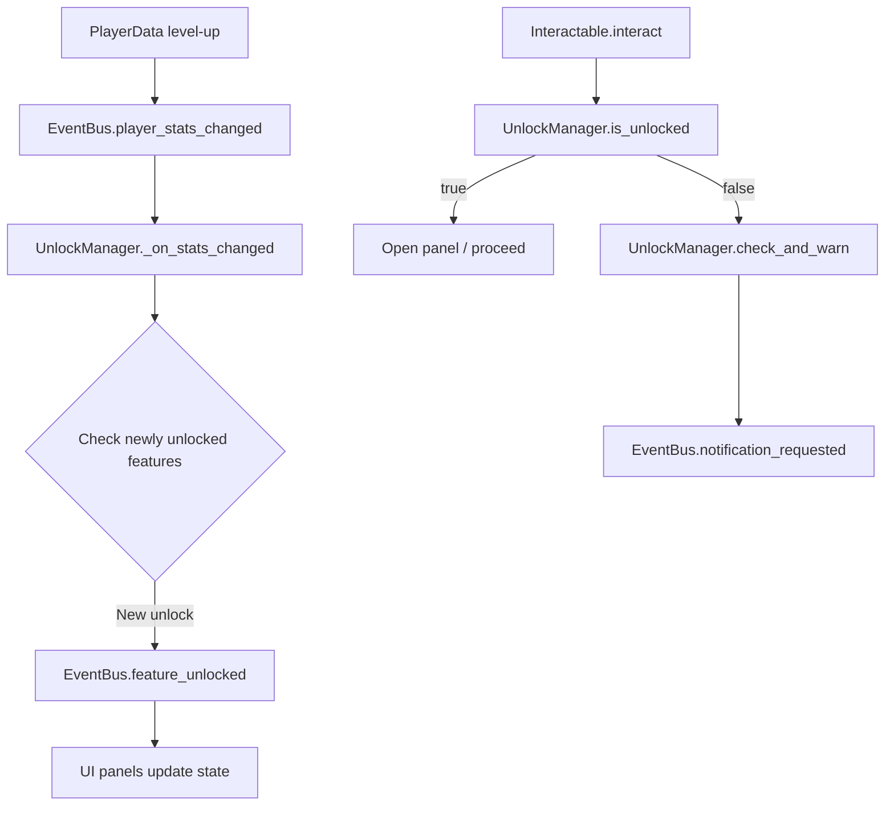
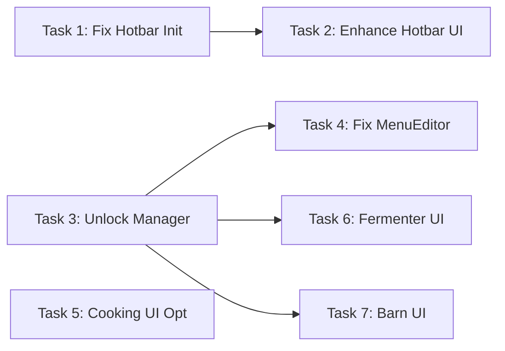

# UI Defect Fix & Logic Optimization Plan

## Overview

This plan addresses 7 tasks for the 客栈\_demo Godot 4 inn management game: fixing UI bugs, creating missing panels, and implementing a global unlock system. All changes follow Godot best practices: signal-based decoupling, UI-data separation, and on-demand node initialization.

---

## Task 1: Fix Initial Tools Not Loading Into Hotbar

### Root Cause

[`_initialize_starting_items()`](core/inventory_manager.gd:172) creates 40 empty slots then calls [`add_item()`](core/inventory_manager.gd:203) for each starting item. `add_item()` fills from index 0 upward, so all tools land in inventory slots 0–17. The hotbar reads indices 30–39 via [`get_hotbar_item()`](core/inventory_manager.gd:261), which remain empty.

### Fix Strategy

Modify `_initialize_starting_items()` to place tool items directly into hotbar slots 30–39 instead of relying on `add_item()` sequential fill. After placing hotbar items, use `add_item()` for the remaining consumable/ingredient items.

### Files to Modify

- [`core/inventory_manager.gd`](core/inventory_manager.gd) — Rewrite `_initialize_starting_items()` to:
  1. Clear and init 40 empty slots as before
  2. Directly assign tools to hotbar indices: `items[30] = {id: &"WateringCan", amount: 1}`, etc.
  3. Call `add_item()` for non-tool items (seeds, ingredients, gold) which fill inventory slots 0–N
  4. Emit `inventory_changed` once at the end

### Hotbar Tool Assignment Map

| Slot | Index | Item        |
| ---- | ----- | ----------- |
| 1    | 30    | WateringCan |
| 2    | 31    | Hoe         |
| 3    | 32    | Sickle      |
| 4    | 33    | Axe         |
| 5–10 | 34–39 | empty       |

---

## Task 2: Enhance Hotbar UI Visuals

### Current State

[`HotbarNew.gd`](ui/hotbar/HotbarNew.gd) already has:

- Slot borders via `StyleBoxFlat` (grey, 1px border)
- Selection highlight (yellow 2px border, darker bg)
- Count label (font_size 10, white)
- Key label (font_size 9, grey)

### Enhancement Plan

Improve visual clarity without major restructuring:

1. **Slot borders**: Increase border width to 2px, use warmer border color for better contrast against dark backgrounds
2. **Selected state**: Add a subtle glow/inner shadow effect, brighter background, thicker golden border (3px)
3. **Count label**: Position as overlay in bottom-right corner instead of below icon, add dark background panel for readability
4. **Empty slot**: Add subtle cross-hatch or dim icon placeholder to indicate clickability
5. **Tooltip**: Add tooltip on hover showing item name via [`get_item_info()`](core/inventory_manager.gd:197)

### Files to Modify

- [`ui/hotbar/HotbarNew.gd`](ui/hotbar/HotbarNew.gd) — Update `_create_slot()`, `_update_display()`, `_selected_style()`, add hover tooltip logic

---

## Task 3: Implement Global Unlock/Permission Check Mechanism

### Current State

- [`PlayerData`](core/player_data.gd) has `inn_level`, `cooking_level`, `ranching_level`, `farming_level` but no unlock checking
- No centralized system to gate features by level/condition
- Each panel/component would need to independently check levels

### Design

Create an `UnlockManager` autoload that:

1. **Defines unlock requirements** as a Dictionary mapping feature keys to conditions
2. **Provides `is_unlocked(feature: StringName) -> bool`** that checks player data against requirements
3. **Provides `get_unlock_reason(feature: StringName) -> String`** that returns a localized reason string
4. **Emits `feature_unlocked(feature)` signal** when a level-up triggers an unlock
5. **Provides a `check_and_warn(feature)` helper** that shows a notification if not unlocked

### Unlock Requirements Table

| Feature Key        | Requirement           | Description       |
| ------------------ | --------------------- | ----------------- |
| `fermenter`        | `inn_level >= 2`      | 发酵坛需客栈2级   |
| `barn_manage`      | `ranching_level >= 2` | 牧场管理需畜牧2级 |
| `menu_edit`        | `cooking_level >= 1`  | 菜单编辑需烹饪1级 |
| `cooking_advanced` | `cooking_level >= 3`  | 高级烹饪需烹饪3级 |
| `shop`             | `inn_level >= 1`      | 商店始终可用      |
| `incubator`        | `ranching_level >= 3` | 孵化器需畜牧3级   |

### Files to Create

- [`core/unlock_manager.gd`](core/unlock_manager.gd) — New autoload script

### Files to Modify

- [`project.godot`](project.godot) — Register UnlockManager autoload
- [`core/event_bus.gd`](core/event_bus.gd) — Add `feature_unlocked(feature: StringName)` signal
- [`core/player_data.gd`](core/player_data.gd) — Emit check signal on level-up

### Architecture Diagram



---

## Task 4: Fix MenuEditor Empty List Bug

### Root Cause

[`_get_unlocked_dishes()`](ui/menu_editor/MenuEditor.gd:80) returns a hardcoded array of 3 dishes. It never checks player unlock state or recipe data, so it always shows the same 3 items regardless of progress.

### Fix Strategy

1. **Create recipe data resources** in `data/recipes/` using the [`RecipeData`](scripts/resources/recipe_data.gd) resource class
2. **Add a recipe registry** to `InventoryManager` or create a dedicated `RecipeManager` that loads all recipe resources
3. **Rewrite `_get_unlocked_dishes()`** to:
   - Query the recipe registry for all recipes
   - Filter by `required_cooking_level <= PlayerData.cooking_level`
   - Return matching dishes with id and display_name

### Recipe Data Structure

Each `.tres` resource file uses [`recipe_data.gd`](scripts/resources/recipe_data.gd):

```
recipe_id: "hongshaorou"
display_name: "红烧肉"
ingredients: { main: "Pork:2", sub: "SoySauce:1", seasoning: "Spice:1", fuel: "Firewood:1" }
output_item_id: "Hongshaorou"
required_cooking_level: 1
```

### Files to Create

- [`data/recipes/hongshaorou.tres`](data/recipes/hongshaorou.tres)
- [`data/recipes/qingzhengyu.tres`](data/recipes/qingzhengyu.tres)
- [`data/recipes/huadiaotang.tres`](data/recipes/huadiaotang.tres)
- Additional recipes for higher cooking levels

### Files to Modify

- [`ui/menu_editor/MenuEditor.gd`](ui/menu_editor/MenuEditor.gd) — Rewrite `_get_unlocked_dishes()` to load from recipe resources and filter by cooking_level
- [`core/inventory_manager.gd`](core/inventory_manager.gd) — Add recipe registry methods or create separate RecipeManager

---

## Task 5: Optimize Cooking UI Ingredient Display

### Current State

[`CookingUI.gd`](ui/cooking/CookingUI.gd) already shows ingredient counts with color coding. The `_update_ingredient_list()` method displays each ingredient with have/needed counts and green/red coloring.

### Enhancement Plan

Verify and improve the existing display:

1. **Format**: Ensure each ingredient shows as `鸡蛋 1/2` format with clear have/needed
2. **Color coding**: Green when have >= needed, red when short, with bold for the count portion
3. **Missing ingredients summary**: Add a summary line at bottom: "缺少 2 种食材" when ingredients are insufficient
4. **Cook button state**: Disable cook button and show reason when ingredients are missing
5. **Level lock indicator**: Show lock icon and required level for recipes above current cooking_level

### Files to Modify

- [`ui/cooking/CookingUI.gd`](ui/cooking/CookingUI.gd) — Update ingredient display formatting, add missing summary, integrate with UnlockManager

---

## Task 6: Create Fermenter UI Panel

### Current State

[`fermentation_jar.gd`](scripts/components/fermentation_jar.gd) has full backend logic (place content, daily fermentation, collect, quality tiers) but NO UI. The `interact()` method only emits `player_interacted`.

### UI Design

```
┌─────────────────────────────────┐
│         发 酵 坛                 │
├─────────────────────────────────┤
│                                 │
│  ┌──────┐    ┌──────┐          │
│  │ 输入  │ →  │ 输出  │          │
│  │ 物料  │    │ 产物  │          │
│  └──────┘    └──────┘          │
│                                 │
│  品质: ●●○ 普通                 │
│  进度: ████████░░ 6/8 天        │
│                                 │
│  [ 放入物料 ]  [ 取出 ]         │
│                                 │
└─────────────────────────────────┘
```

### Implementation Plan

1. **Create `FermenterUI.tscn`** — Control scene with PanelContainer layout
2. **Create `FermenterUI.gd`** — Script that:
   - Receives reference to the `FermentationJarInteractable` being interacted with
   - Shows input slot (click to select item from inventory)
   - Shows fermentation progress bar (days / quality tier thresholds)
   - Shows output preview with current quality
   - Place Content button: calls `jar.place_content()`
   - Collect button: calls `jar.collect()`
   - Listens to `inventory_changed` to refresh available items
3. **Add FermenterUI node** to `game_ui.tscn` PanelLayer
4. **Modify `fermentation_jar.gd`** `interact()` to open the FermenterUI panel via GameUI
5. **Integrate with UnlockManager** — check `fermenter` feature unlock before opening

### Files to Create

- [`ui/fermenter/FermenterUI.gd`](ui/fermenter/FermenterUI.gd)
- [`ui/fermenter/FermenterUI.tscn`](ui/fermenter/FermenterUI.tscn)

### Files to Modify

- [`ui/game_ui.tscn`](ui/game_ui.tscn) — Add FermenterUI node to PanelLayer
- [`scripts/components/fermentation_jar.gd`](scripts/components/fermentation_jar.gd) — Update `interact()` to open FermenterUI

---

## Task 7: Create Barn Management UI Panel

### Current State

[`BarnInterior.gd`](scenes/barn/BarnInterior.gd) manages animals via direct Interactable nodes (FeedTrough, WaterTrough, Incubator, ControlBox). There is no overview panel showing all animals, their status, or batch operations.

### UI Design

```
┌──────────────────────────────────────┐
│           牧 场 管 理                 │
├──────────────────────────────────────┤
│  容量: 3/10                          │
│                                      │
│  ┌────────────────────────────────┐  │
│  │ 🐔 母鸡  ❤️健康  🍗已喂  💧已喂 │  │
│  │ 🐔 母鸡  ❤️健康  🍗已喂  💧已喂 │  │
│  │ 🐷 小猪  ⚠️饥饿  🍗未喂  💧已喂 │  │
│  └────────────────────────────────┘  │
│                                      │
│  产物待收: 鸡蛋x3                    │
│                                      │
│  [ 全部喂食 ]  [ 全部喂水 ]          │
│  [ 收取产物 ]  [ 一键操作 ]          │
│                                      │
└──────────────────────────────────────┘
```

### Implementation Plan

1. **Create `BarnManagementUI.tscn`** — Control scene with PanelContainer layout
2. **Create `BarnManagementUI.gd`** — Script that:
   - Receives reference to `BarnInterior` node
   - Lists all animals with name, state icon, fed/watered status, satiety bar
   - Shows occupancy count
   - Shows pending products ready for collection
   - Batch action buttons: Feed All, Water All, Collect Products, Quick All
   - Individual animal detail on click: sell, status history
   - Listens to `animal_state_changed` signal to refresh
3. **Add BarnManagementUI node** to `game_ui.tscn` PanelLayer
4. **Modify `BarnInterior.gd`** — Update `control_box` interaction to open BarnManagementUI
5. **Integrate with UnlockManager** — check `barn_manage` feature unlock

### Files to Create

- [`ui/barn/BarnManagementUI.gd`](ui/barn/BarnManagementUI.gd)
- [`ui/barn/BarnManagementUI.tscn`](ui/barn/BarnManagementUI.tscn)

### Files to Modify

- [`ui/game_ui.tscn`](ui/game_ui.tscn) — Add BarnManagementUI node to PanelLayer
- [`scenes/barn/BarnInterior.gd`](scenes/barn/BarnInterior.gd) — Update control_box interaction to open BarnManagementUI
- [`scenes/barn/AnimalBase.gd`](scenes/barn/AnimalBase.gd) — Add `animal_state_changed` signal emission

---

## Execution Order

The tasks should be implemented in this dependency order:



1. **Task 1** — Hotbar init fix (standalone, foundational)
2. **Task 2** — Hotbar UI enhancement (depends on Task 1 for correct data)
3. **Task 3** — Unlock Manager (foundational for Tasks 4, 6, 7)
4. **Task 4** — MenuEditor fix (depends on Task 3 for unlock checks)
5. **Task 5** — Cooking UI optimization (standalone)
6. **Task 6** — Fermenter UI (depends on Task 3 for unlock checks)
7. **Task 7** — Barn Management UI (depends on Task 3 for unlock checks)

---

## Key Architecture Decisions

1. **UnlockManager as Autoload** — Global singleton ensures any script can check unlock state without node path dependencies
2. **Panel opening pattern** — All new panels follow existing `GameUI.open_panel()` / `GameUI.close_panel()` pattern with pause support
3. **Data-driven recipes** — Recipe data stored as `.tres` Resource files for designer editability, loaded at runtime
4. **Signal-based refresh** — New UI panels connect to `EventBus.inventory_changed`, `EventBus.animal_state_changed` etc. for automatic refresh
5. **Backward compatibility** — All changes preserve existing save/load data structures; new fields use `get()` with defaults
